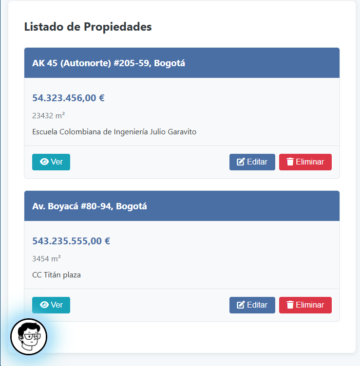
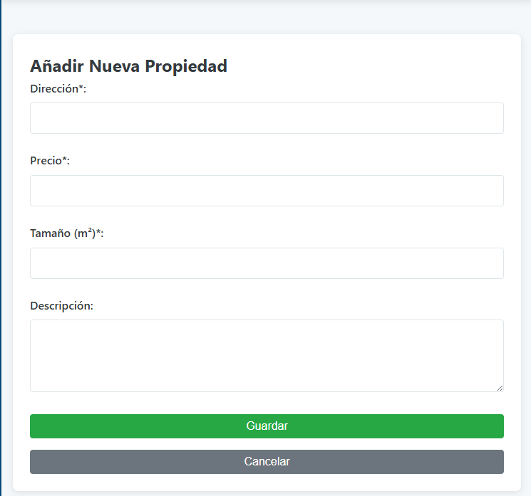
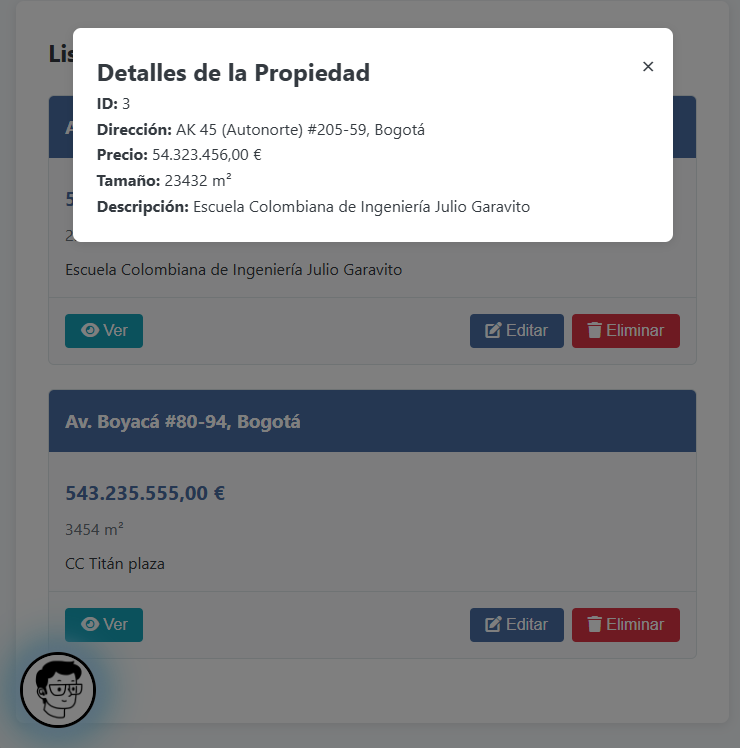
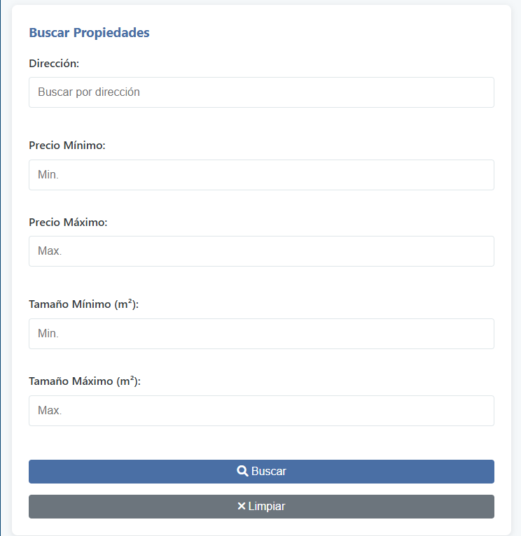
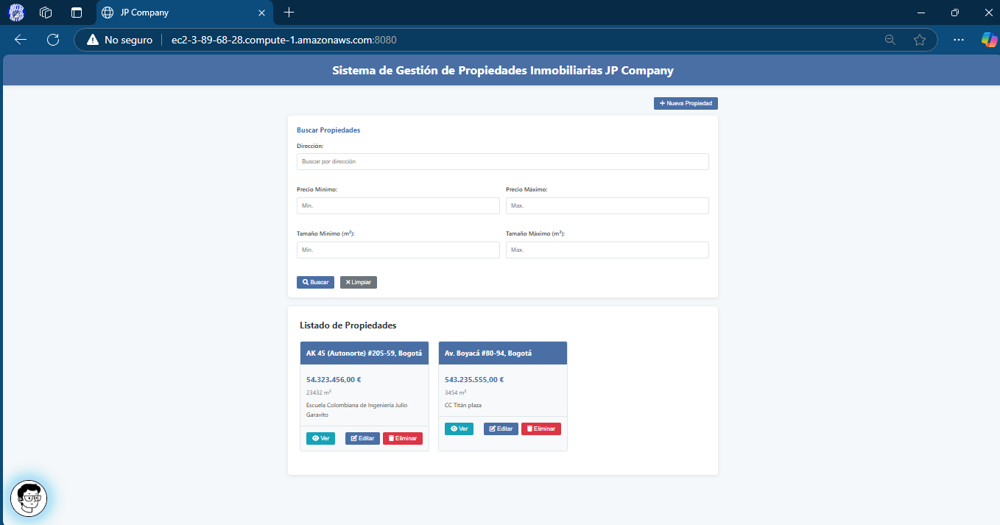

# Sistema de Gestión de Propiedades Inmobiliarias

https://github.com/user-attachments/assets/579d7729-21d1-4c72-8e53-b5a28dc48452

## 📌 Resumen del Proyecto

Este sistema proporciona una plataforma completa para la gestión de propiedades inmobiliarias. Permite a los usuarios realizar operaciones CRUD (Crear, Leer, Actualizar, Eliminar) sobre listados de propiedades, con una interfaz de usuario intuitiva y capacidades de búsqueda avanzada.

### Características principales:

- Registro y administración de propiedades inmobiliarias
- Búsqueda avanzada por dirección, precio y tamaño
- Paginación para manejar grandes volúmenes de datos
- Interfaz de usuario responsive
- Despliegue en la nube de AWS con arquitectura de microservicios

## 🔍 Arquitectura del Sistema

El sistema sigue una arquitectura de tres capas con separación de responsabilidades:

### Frontend

- Desarrollado con HTML5, CSS3 y JavaScript
- Interfaz responsive con grid CSS y flexbox
- Sistema de notificaciones para proporcionar feedback al usuario
- Comunicación asíncrona con el backend mediante Fetch API

### Backend (API REST)

- Desarrollado con Spring Boot
- Implementación de patrón MVC (Model-View-Controller)
- API RESTful para todas las operaciones CRUD
- Validación de datos en el servidor
- Paginación y búsqueda avanzada

### Base de Datos

- MySQL 8.0 para almacenamiento persistente
- JPA/Hibernate para mapeo objeto-relacional
- Esquema de base de datos automatizado con Hibernate DDL

### Diagrama de Arquitectura

## ✖️ Diseño de Clases

### Modelo de Datos

- **Property:** Entidad principal que representa una propiedad inmobiliaria
    - Atributos: id, address, price, size, description
    - Anotaciones JPA para mapeo a base de datos
    - Validaciones para asegurar integridad de datos

### Capa de Repositorio

- **PropertyRepository:** Interfaz que extiende JpaRepository
    - Métodos heredados para operaciones CRUD básicas
    - Métodos personalizados para búsquedas avanzadas

### Capa de Servicio

- **PropertyService:** Interfaz que define operaciones de negocio
- **PropertyServiceImpl:** Implementación de la interfaz de servicio
    - Lógica para obtener, crear, actualizar y eliminar propiedades
    - Manejo de paginación y búsquedas

### Capa de Controlador

- **PropertyController:** Controlador REST
    - Endpoints para operaciones CRUD
    - Manejo de solicitudes HTTP y respuestas
    - Validación de entrada y manejo de errores

## 👀 Capturas

1. Listado de Propiedades

2. Formulario de Creación

3. Detalles de Propiedad

4. Búsqueda Avanzada

## 🖥️ Tecnologías Utilizadas

- Frontend: HTML5, CSS3, JavaScript
- Backend: Java 17, Spring Boot 2.7.8, Spring Data JPA
- Base de Datos: MySQL 8.0
- Despliegue: AWS (EC2, RDS, VPC)
- Herramientas de Construcción: Maven

## 🔝 Cliente desplegado en AWS

Video del despliegue:

([Video_DespliegueAWS](./img/202503031807.mp4))

## 📌 Autor

- Juan Pablo Daza Pereira ([JuanPabl07DP](https://github.com/JuanPabl07DP))

## 📅 **Fecha de creación: Febrero 2025**
